# Interview Assistant - Realtime Recruiter Assistant Agent

Interview intelligence assistant combining live transcription and JD/CV analysis for recruiter interviews.

## Live Demo

The app is deployed on **GCP** and available at:

**🔗 [https://composite-store-462308-i-f043b.web.app](https://composite-store-462308-i-f043b.web.app)**

Please try it out! You can create an account, upload a JD and CV, start a live interview session, and explore the AI-powered features.

## Assignment mapping (Lead Gen AI Engineer)

> Note: This README is written as a “design + submission” document. The intent is to capture reasoning, trade-offs, and engineering philosophy (not just feature lists).

This project maps most closely to **Option 4 — Career Intelligence Assistant**:
- Upload a **CV** and a **Job Description** (per session)
- Use RAG to answer questions about **fit, skill gaps, evidence, and interview preparation**

It also includes pieces of:
- **Option 3 (bonus)**: voice-to-transcript during an interview (OpenAI Realtime via WebRTC) + diarized transcript generation
- **Option 1**: “chat with your docs” style Q&A, grounded on JD/CV/transcript context

### Core user journey (what you can demo)
- **Login** → **Welcome** → **Recruiter Assistant Agent**
- **Setup**: create session + select JD & CV + upload both
- **Interview**: live transcription + “AI Actions” to drive next questions
- **Report**: generate **high-quality diarized transcript** (saved sessions appear under **Saved Sessions**)
- **Q&A**: ask questions grounded in JD/CV/transcript with citations

### Example queries
- “What skills are missing for this JD based on the CV and interview transcript?”
- “What are the strongest evidence-backed strengths we observed?”
- “Which JD requirements are not yet covered and what should I ask next?”
- “List red flags or inconsistencies between the CV and what was said.”

## Quick setup (local)

Backend:

```bash
cd backend
cp .env.example .env
pip install -r requirements.txt
uvicorn main:app --reload
```

Frontend:

```bash
cd frontend
cp .env.example .env
npm install
npm start
```

## Architecture overview

```mermaid
flowchart LR
  User[Recruiter] --> UI[Frontend React]
  UI --> API[Backend FastAPI]

  API --> PG[(Postgres + pgvector)]
  API --> GCS[(GCS Bucket)]

  API --> OpenAI[OpenAI APIs<br/>Embeddings • Chat/Actions • Realtime • Diarize]
  UI --> OpenAIRealtime[OpenAI Realtime WebRTC]
```



Key storage:
- **GCS**: original uploaded files + interview audio
- **Postgres**: users, sessions, extracted text, and **`rag_chunks`** (pgvector) for retrieval

## Key technical decisions (and why)

- **Session-scoped RAG namespace** (filter by `session_id` in `rag_chunks`)
  - Why: keeps retrieval simple and prevents “cross-session leakage” by default.
  - Trade-off: cross-session / org-wide search and analytics require additional indexing strategy.
- **Index-on-ingest for JD/CV + transcript**
  - Why: retrieval at Q&A time is fast and predictable.
  - Trade-off: uploads/finalize step do more work (embedding calls).
- **Two-stage transcript strategy**
  - Live transcript for “in the moment” actions + Q&A
  - Offline diarized transcript for higher-quality reporting and saved sessions
- **GCS for raw artifacts**
  - Why: cheap, durable storage for files/audio; DB keeps only structured metadata + extracted text.
- **Minimal orchestration (explicit code over frameworks)**
  - Why: easier to reason about, fewer dependencies, faster iteration under time constraints.
- **UI gating**
  - Interview step is locked until both JD and CV are uploaded to ensure RAG/actions have grounding context.

## API surface (selected endpoints)

- **Auth**
  - `POST /api/auth/register`
  - `POST /api/auth/login`
  - `GET /api/auth/me`
- **Sessions**
  - `POST /api/sessions` (create)
  - `POST /api/sessions/{id}/documents` (upload JD/CV)
  - `GET /api/sessions/{id}` (load)
  - `GET /api/sessions?saved_only=true` (saved sessions list)
- **Realtime transcription**
  - `POST /api/realtime/session` (mints OpenAI Realtime client token)
- **Interview / analysis**
  - `PUT /api/interview/sessions/{id}/transcript` (persist final transcript / utterances)
  - `POST /api/interview/sessions/{id}/action` (action prompts grounded in JD/CV/transcript)
  - `POST /api/interview/sessions/{id}/chat` (RAG Q&A with citations)
  - `POST /api/interview/sessions/{id}/audio` (upload audio)
  - `POST /api/interview/sessions/{id}/finalize` (generate diarized transcript)

## RAG / LLM approach & decisions

> **Note on RAG necessity**: For a single session with one JD, one CV, and one transcript, RAG is not strictly necessary—these documents are typically short enough to fit within LLM context windows. However, RAG was included to respect the assignment requirements (Option 4 explicitly calls for RAG-based retrieval). Additionally, RAG becomes valuable when scaling to cross-session or user-level analysis: matching multiple CVs against multiple JDs, comparing transcripts across sessions, and performing batch matching/ranking operations. The current implementation sets the foundation for these future use cases.

### Models
- **Embeddings**: `text-embedding-3-small` (configured via `EMBEDDING_MODEL`)
- **Action + Chat LLM**: `gpt-4o-mini` (configured via `ACTION_MODEL`)
- **Realtime transcription**: `gpt-4o-transcribe` (configured via `REALTIME_MODEL`)
- **Diarized transcription**: `gpt-4o-transcribe-diarize` (currently hardcoded as `DIARIZE_MODEL`)

### Orchestration framework
- Chosen: **none** (direct OpenAI SDK calls + small, explicit helper functions).
- Considered: LangChain / LlamaIndex.
- Why: keep the moving parts minimal (debuggability + speed of iteration) for a small, end-to-end demo under tight time constraints.

### Vector database
- Chosen: **Postgres + pgvector** (`CREATE EXTENSION vector`) with a single `rag_chunks` table.
- Considered: ChromaDB / managed vector DBs (Pinecone / Weaviate).
- Why: single persistence layer (sessions + docs + vectors), simple ops, easy to deploy on Cloud SQL.

### Chunking
- Sentence-based chunking using a simple punctuation splitter with **character-based** size:
  - `CHUNK_SIZE=200`, `CHUNK_OVERLAP=50` in `backend/services/rag_service.py`
- Why (trade-off): optimized for speed + simplicity under time constraints; works well for short JD/CV docs.
- With more time: token-aware chunking, semantic chunking by section headings, per-doc metadata, and chunk de-dup.

### Retrieval
- Pure vector similarity search in Postgres using `embedding <=> query_embedding` with `top_k` capped (1..8).
- With more time: hybrid retrieval (BM25 + vector), MMR, reranking, and per-source weighting (JD vs CV vs transcript).

### Prompt + context management
- **Chat endpoint**: “answer using only provided context” + bracket citations, with sanitization to remove invalid citations.
- **Action endpoint**: packages JD + CV + transcript + action prompt, and caps output length (1200 chars).
- With more time: structured JSON outputs, improved system prompts per action type, and evaluation prompts for self-checks.

### Guardrails, quality, observability
- Guardrails currently implemented:
  - Citation-only answering for Q&A
  - Output length caps
  - Input validation + auth checks
- Not yet implemented (would add for production):
  - PII redaction, content moderation, rate limiting, per-org RBAC, audit logs
  - Offline eval harness + golden datasets + regression tests for RAG quality
  - Tracing (OpenTelemetry) and metrics (latency, token usage, embedding/query counts)

## Productionization (what’s needed)

The repo includes simple deployment scripts:
- Backend → **Cloud Run**: `scripts/deployment/deploy_backend.sh`
- Frontend → **Firebase Hosting**: `scripts/deployment/deploy_frontend.sh`

To productionize on AWS/GCP/Azure beyond a demo:
- **Security**: Secret Manager, least-privilege service accounts, HTTPS-only, hardened CORS, WAF, PII controls.
- **Scalability**: async/background jobs for indexing + diarization, queue (Pub/Sub/SQS), horizontal scaling, caching.
- **Reliability**: retries, circuit breakers, timeouts, idempotency, backpressure on transcription/action endpoints.
- **Data**: DB migrations, backups, retention policies for audio/transcripts, encryption at rest, GDPR-style exports/deletion.
- **CI/CD**: lint + typecheck + unit/integration tests + deploy pipeline (Cloud Build/GitHub Actions).

## Engineering standards & trade-offs (10-hour constraint)

Engineering standards I followed:
- Keep components/services small and explicit (no “magic” orchestration)
- Typed request/response models (FastAPI + Pydantic) and typed frontend (TypeScript)
- Separation of concerns (API layer, services layer, DB layer)
- Defensive validation on endpoints (auth required, required payload checks, bounded parameters)

Due to time constraints (**~10 hours**), I prioritized an end-to-end working system and consciously skipped:
- GitHub setup + a full professional CI/CD pipeline
- Project-wide linting/formatting enforcement (ruff/black/prettier/eslint rules beyond defaults)
- API test suite + load tests
- Packaging/tooling upgrades (Poetry, uv, pnpm, monorepo tooling, release automation)

## How I used AI coding tools

I used an AI coding assistant (Cursor) to accelerate:
- UI refactors (componentization + Tailwind design system)
- Deployment scripts inspired by an existing reference project
- Boilerplate + iteration speed

My rule: use AI for drafting and refactors, but validate by:
- Reading the code end-to-end
- Running the app locally
- Ensuring prompts/guardrails match the intended behavior

## What I would do with more time

- **Engineering**
  - Add GitHub + CI/CD (lint, typecheck, tests, deploy) and structured logging/tracing
  - Add evaluation harness for RAG (offline benchmark + regression gating)
  - Improve chunking/retrieval (hybrid search + reranking) and reduce latency/cost

- **Product roadmap**
  - Implement **Recruiter Automated Agent** (end-to-end interview driver)
  - Add **deep matching analysis** across all stored CVs/JDs/transcripts (saved sessions):
    - Rank best CVs per JD with evidence-backed reasoning
    - Generate recruiter-facing reports and allocations (top candidates per role)
    - Support multi-JD + multi-CV batch ingestion
## Deployment (Cloud Run + Firebase)

Deployment scripts live under `scripts/deployment/`:
- Backend → **Cloud Run**: `scripts/deployment/deploy_backend.sh`
- Frontend → **Firebase Hosting**: `scripts/deployment/deploy_frontend.sh`

### Backend (Cloud Run)

Prereqs:
- `gcloud` installed and authenticated (`gcloud auth login`)
- Either:
  - **Secret Manager** secrets (recommended) with the same names as the env vars below, or
  - A local env file (default `ENV_FILE=".env.deploy"`) that the script will load

Minimum config:
- `PROJECT_ID`, `REGION`
- `SECRET_KEY`, `OPENAI_API_KEY`, `GCS_BUCKET`
- Database:
  - `CLOUDSQL_INSTANCE` + `DATABASE_PASSWORD` (+ optional `DATABASE_USER`, `DATABASE_NAME`)
  - (Optional) `DATABASE_URL` can be set to override construction

Run:

```bash
chmod +x ./scripts/deployment/deploy_backend.sh
export ENV_FILE=".env.deploy"
./scripts/deployment/deploy_backend.sh
```

### Frontend (Firebase Hosting)

Prereqs:
- Firebase CLI installed (`npm install -g firebase-tools`) and authenticated (`firebase login`)

Minimum config:
- `FIREBASE_PROJECT`
- `REACT_APP_API_URL` (Cloud Run service URL)

Run:

```bash
chmod +x ./scripts/deployment/deploy_frontend.sh
export ENV_FILE=".env.deploy"
./scripts/deployment/deploy_frontend.sh
```

## Repository structure

```text
Realtime_Recuiter_Assisant_Agent/
├── backend/                 # FastAPI app (auth, sessions, realtime, interview APIs)
├── frontend/                # React (CRA) app
├── scripts/deployment/      # Cloud Run + Firebase deployment scripts
└── README.md
```

## Notes

- `.env.deploy` contains secrets and is **gitignored** — use Secret Manager for real deployments.
